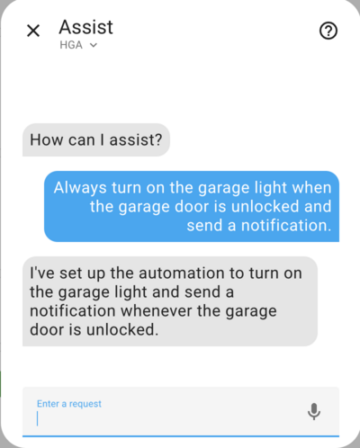
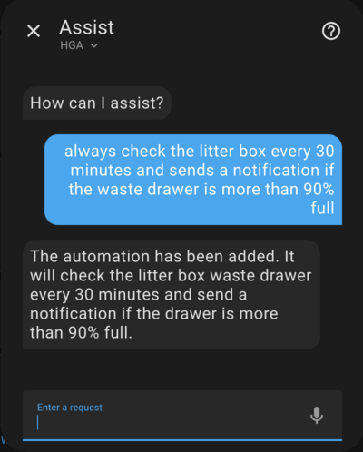
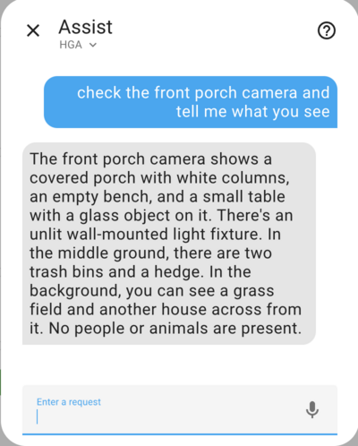
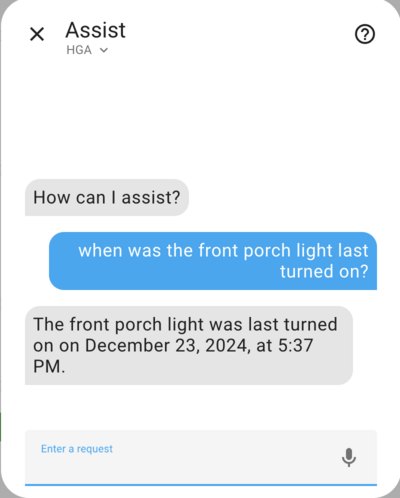

# home-generative-agent

[![GitHub Release][releases-shield]][releases]
[![GitHub Activity][commits-shield]][commits]
[![License][license-shield]](LICENSE)

![Project Maintenance][maintenance-shield]

The goal of this project is to create a generative AI agent integration for Home Assistant that understands your home's context, learn your preferences and interact with you and your home to accomplish activities you find valuable. The AI agent is built using [LangChain](https://www.langchain.com/) and [LangGraph](https://www.langchain.com/langgraph) which allows for scalable and cutting edge solutions by leveraging these world-class frameworks which are tightly integrated into Home Assistant. A hybrid cloud - edge solution is used that balances cost, accuracy and latency.

he following features are supported.

- Create complex Home Assistant automation.
- Image scene analysis and understanding.
- Home state analysis of entities, devices and areas.
- Full agent control of allowed entities in the home.
- Short- and long-term memory using semantic search.
- Automatic summarization of home state to manage LLM context length.

This integration will set up the `conversation` platform which allows the user to directly converse with Home Generative Assistant.

## Example Use Cases
Create an automation.



Create an automation that runs periodically.



You can see that the agent is fluent in yaml by what it generated and registered as a HA automation by the snippet below.

```yaml
alias: Check Litter Box Waste Drawer
triggers:
  - minutes: /30
    trigger: time_pattern
conditions:
  - condition: numeric_state
    entity_id: sensor.litter_robot_4_waste_drawer
    above: 90
actions:
  - data:
      message: The Litter Box waste drawer is more than 90% full!
    action: notify.notify
```

Check a single camera.



Check multiple cameras.

https://github.com/user-attachments/assets/230baae5-8702-4375-a3f0-ffa981ee66a3

Check the history of a light.



Report power consumption of an appliance.
TBA

Summarize home state.

https://github.com/user-attachments/assets/96f834a8-58cc-4bd9-a899-4604c1103a98


Long-term memory with semantic search.
TBA

Proactive notification of package delivery.
TBA

## Architecture and Design

A high-level view of the architecture is shown below.


The general integration architecture follows the best practices as described in [Home Assistant Core](https://developers.home-assistant.io/docs/development_index/) and is compliant with [Home Assistant Community Store](https://www.hacs.xyz/) (HACS) publishing requirements.

The agent is built using langgraph and uses the HA `conversation` component to interact with the user. The agent uses the Home Assistant LLM API to fetch the state of the home and to understand the HA native tools it has at its deposal. All other tools available to the agent are implemented using langchain. The agent employs several LLMs, a large and very accurate primary model for high-level reasoning and smaller specialized helper models for camera image analysis, primary model context summarization and embedding generation for long-term sematic search. The primary model is cloud-based and the helper models are edge-based and run under the [Ollama](https://ollama.com/) framework on a computer located in the home. The models currently being used are summarized below.

Model | Location | Purpose
-- | -- | -- |
[GPT-4o](https://platform.openai.com/docs/models#gpt-4o) | OpenAI Cloud | High-level reasoning
[llama-3.2-vision-11b](https://ollama.com/library/llama3.2-vision) | Ollama Edge | Image scene analysis
[llama-3.2-vision-11b](https://ollama.com/library/llama3.2-vision) | Ollama Edge | Primary model context summarization
[mxbai-embed-large](https://ollama.com/library/mxbai-embed-large) | Ollama Edge | Embedding generation for sematic search

You need to carefully manage the context length of LLMs to balance cost, accuracy and latency and to avoid triggering rate limits such as OpenAI's Tokens per Minute restriction. The context length of the primary model is controlled in two ways, the messages in the context are trimmed if they exceed a max parameter and the context is summarized once the number of messages exceed another parameter. The messages may be trimmed only after content summarization. These parameters are configurable in `const.py` and you can see a description of them below.

Parameter | Descritption | Default
-- | -- | -- |
`CONTEXT_MAX_MESSAGES` |  Messages to keep in context before deletion | 100
`CONTEXT_SUMMARIZE_THRESHOLD` | Messages in context before summary generation | 20

The latency between user requests or the agent taking timely action on the user's behalf, is very important for you to consider in the design. I used several techniques to reduce latency which include using specialized, smaller helper LLMs running on the edge and facilitation of primary model prompt caching by structuring the prompts to put static content such as instructions and examples up front and variable content such as user-specific information at the end. These techniques also reduce primary model usage cost considerably.

Tools - TBA

## Installation

1. Using the tool of choice open the directory (folder) for your HA configuration (where you find `configuration.yaml`).
2. If you do not have a `custom_components` directory (folder) there, you need to create it.
3. In the `custom_components` directory (folder) create a new folder called `home_generative_agent`.
4. Download _all_ the files from the `custom_components/home_generative_agent/` directory (folder) in this repository.
4. Place the files you downloaded in the new directory (folder) you created.
6. Restart Home Assistant
7. In the HA UI go to "Configuration" -> "Integrations" click "+" and search for "Home Generative Agent"

## Configuration
Configuration is done in the UI and via the parameters in `constant.py`.

<!---->

## Contributions are welcome!

If you want to contribute to this please read the [Contribution guidelines](CONTRIBUTING.md)

***

[home_generative_agent]: https://github.com/goruck/home-generative-agent
[commits-shield]: https://img.shields.io/github/commit-activity/y/goruck/home-generative-agent.svg?style=for-the-badge
[commits]: https://github.com/goruck/home-generative-agent/commits/main
[forum-shield]: https://img.shields.io/badge/community-forum-brightgreen.svg?style=for-the-badge
[forum]: https://community.home-assistant.io/
[license-shield]: https://img.shields.io/github/license/ludeeus/integration_blueprint.svg?style=for-the-badge
[maintenance-shield]: https://img.shields.io/badge/maintainer-Lindo%20St%20Angel%20%40goruck-blue.svg?style=for-the-badge
[releases-shield]: https://img.shields.io/github/release/goruck/home_generative_agent.svg?style=for-the-badge
[releases]: https://github.com/goruck/home-generative-agent/releases
